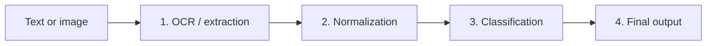

# Medical Bill Amount Detector

A FastAPI backend that reads a medical bill or receipt (typed text or a photo) and returns the amounts on it as structured JSON: which number is the total, which is paid, which is due, and where in the input each one came from.

Built for the **Amount Detection in Medical Documents** problem statement.

## Pipeline



| Step | File | What it does |
|---|---|---|
| 1. OCR / extraction | `app/ocr.py` | Reads images with Tesseract, extracts numeric tokens, detects currency, returns a confidence score |
| 2. Normalization | `app/normalize.py` | Fixes OCR digit errors (`l`→1, `O`→0, `S`→5, `B`→8, `@`→0), parses formats like `1,200.00` and `1,00,000`, keeps percentages separate |
| 3. Classification | `app/classify.py` | Labels each amount from nearby words (total, paid, due, discount, tax). Fuzzy matching handles damaged labels like `Pald` |
| 4. Final output | `app/pipeline.py` | Adds provenance for every amount, checks `paid + due = total`, sets the status |

Each step returns a fixed JSON shape defined in `app/schemas.py` (Pydantic), so every stage can be tested on its own.

## Guardrails

The service prefers "I'm not sure" over a confident wrong answer.

| Situation | Response |
|---|---|
| Empty input, no numbers, or OCR too noisy | `no_amounts_found` |
| Unreadable, empty or oversized (>10 MB) image | `error` |
| Numbers found but none could be labelled | `needs_review` |
| `paid + due` does not match the total | result returned with `status: needs_review` and a warning |
| Low overall confidence | result returned with `status: needs_review` and a warning |

Every value in the output comes from a token found in the input. Nothing is generated.

## Setup

Requirements: Python 3.10+ and the [Tesseract OCR](https://github.com/UB-Mannheim/tesseract/wiki) engine (Windows default path `C:\Program Files\Tesseract-OCR\`).

```bash
python -m venv venv
venv\Scripts\activate        # macOS/Linux: source venv/bin/activate
pip install -r requirements.txt
uvicorn app.main:app --reload
```

Open http://127.0.0.1:8000/docs for the interactive API page. Run the tests with:

```bash
python -m pytest
```

### Optional: LLM fallback

The pipeline works fully without an API key. To let an LLM suggest labels for amounts the rules can't label (for example an unusual phrase like "Net amount"), create a `.env` file in the project root:

```
GEMINI_API_KEY=your-key-here
GEMINI_MODEL=gemini-flash-lite-latest
```

Amounts labelled this way are marked `"labeled_by": "llm"`. The model only receives a numbered list of amounts that were already extracted and can only return a label per index, so it cannot add or change a value. Invalid replies are discarded. If the key is missing or the model is busy, the pipeline falls back to rules. Use anonymised sample bills only, since the free tier may use prompts to improve the provider's products.

## API

| Method | Endpoint | Purpose |
|---|---|---|
| GET | `/health` | Health check |
| POST | `/extract/text` | Full pipeline on typed text |
| POST | `/extract/image` | Full pipeline on an uploaded image |
| POST | `/ocr/text`, `/normalize/text`, `/classify/text` | Run up to a single step (text only) |
| POST | `/ocr/image` | Debug: raw OCR output before any correction |

## Examples

The commands use Windows PowerShell (`curl.exe`, since plain `curl` is an alias there). On macOS/Linux use `curl` with single quotes around the JSON.

### Clean text

```bash
curl.exe -X POST http://127.0.0.1:8000/extract/text -H "Content-Type: application/json" -d "{\"text\": \"Total: INR 1200 | Paid: 1000 | Due: 200 | Discount: 10%\"}"
```

```json
{
  "currency": "INR",
  "amounts": [
    {"type": "total_bill", "value": 1200, "source": "text: 'Total: INR 1200'", "raw_source": null, "labeled_by": "rules"},
    {"type": "paid", "value": 1000, "source": "text: 'Paid: 1000'", "raw_source": null, "labeled_by": "rules"},
    {"type": "due", "value": 200, "source": "text: 'Due: 200'", "raw_source": null, "labeled_by": "rules"}
  ],
  "status": "ok",
  "confidence": 0.95,
  "warnings": []
}
```

### Noisy text

```bash
curl.exe -X POST http://127.0.0.1:8000/extract/text -H "Content-Type: application/json" -d "{\"text\": \"T0tal: Rs l200 | Pald: 1000 | Due: 200\"}"
```

`T0tal` is still read as a total and `l200` becomes 1200, with a lower confidence than clean text.

### Image

```bash
curl.exe -X POST http://127.0.0.1:8000/extract/image -F "file=@samples/bill_clean.png"
```

Same response shape. Provenance reads `ocr: '...'`, and `raw_source` shows what Tesseract actually read when it differs from the corrected snippet (for example `Total: INR 12@@`).

### Arithmetic mismatch

```bash
curl.exe -X POST http://127.0.0.1:8000/extract/text -H "Content-Type: application/json" -d "{\"text\": \"Total: INR 1200 | Paid: 1000 | Due: 300\"}"
```

Returns `"status": "needs_review"` with the warning `paid (1000) + due (300) does not equal total (1200)`.

### Nothing to extract

```bash
curl.exe -X POST http://127.0.0.1:8000/extract/text -H "Content-Type: application/json" -d "{\"text\": \"hello\"}"
```

```json
{"status": "no_amounts_found", "reason": "document too noisy"}
```

In Postman, send a POST with a JSON body `{"text": "..."}` to `/extract/text`, or a form-data body with a `file` field to `/extract/image`.

## Project structure

```
app/
  main.py        API endpoints
  schemas.py     JSON contracts for each step
  ocr.py         Step 1
  normalize.py   Step 2
  classify.py    Step 3
  llm.py         Optional Gemini fallback with strict validation
  pipeline.py    Step 4 and chaining
tests/           pytest suite (24 tests)
samples/         sample bill images
```

## Design decisions

- **Rules first, LLM second.** Rules are fast, free and deterministic. The LLM only handles what they miss.
- **Provenance everywhere.** Every amount carries its source snippet, and OCR corrections keep the raw text next to the cleaned version.
- **Cumulative confidence.** Tesseract's confidence, the number of digit corrections and the label match quality all lower the final score.
- **Tests never call the LLM.** `conftest.py` turns it off and the LLM tests use mocks.

While testing a screenshot of my own sample bill, Tesseract read every `0` as `@` (`12@@` instead of `1200`). I added `@` to the look-alike characters and wrote a regression test for it.

## Limitations

- **Hard images.** Heavily crumpled, skewed or low-light photos are not read reliably. A creased retail receipt I tested had most numbers read, but a few digits were wrong and the totals had no clear label next to them, so the service returned `needs_review` instead of guessing.
- **Layout.** Labels are matched to the number next to them. Tables with labels and amounts in separate columns are not handled.
- **Language.** English labels only.
- **Other numbers.** Phone numbers, dates and IDs can be picked up as tokens on messy documents. They usually stay unlabelled, but there is no dedicated filter yet.
- **One bill per document.** The consistency check assumes a single total, paid and due amount.

## Next steps

- Deskew and denoise images (OpenCV) before OCR
- Filter dates, phone numbers and IDs explicitly
- Handle multi-column tables and line items
- Grow the keyword list with more real bill wording

## Demo
